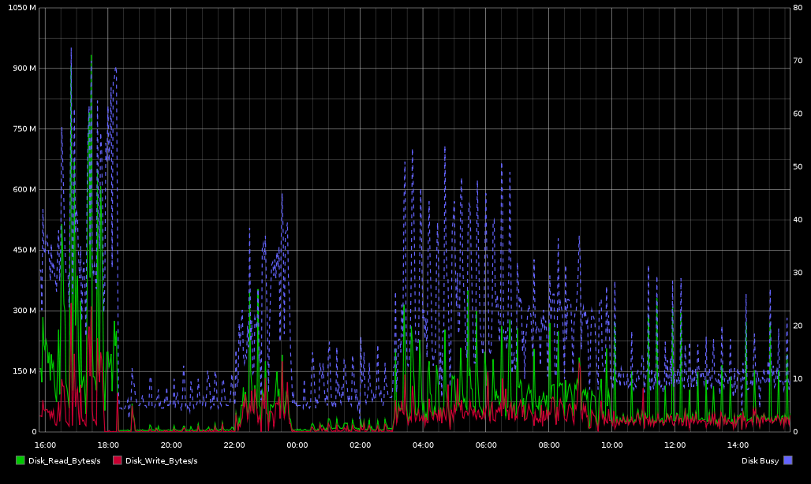
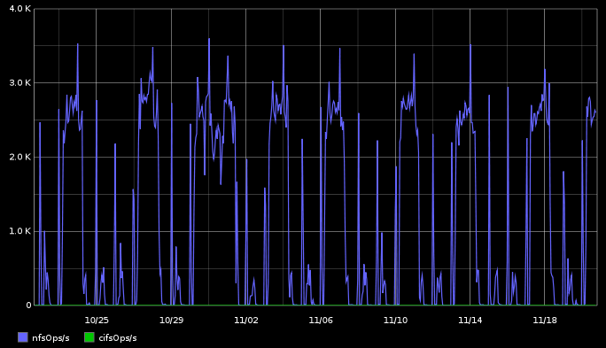
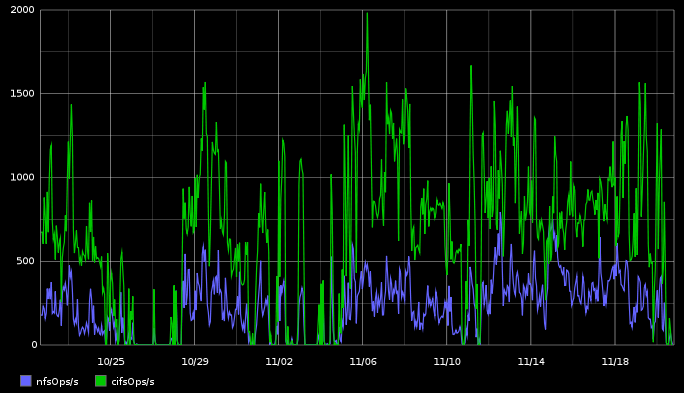
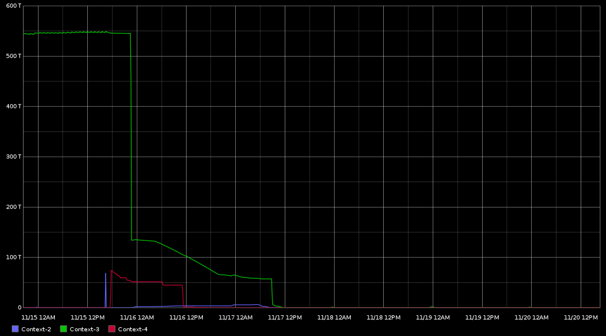
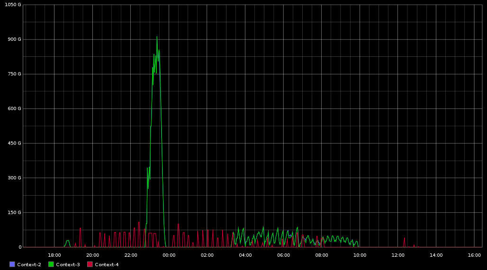

datadomain-monitoring
=====================

EMC Datadomain Availability and Performance Monitoring

nagios, shinken, icinga & co
-----------------------
You should at least check if the DD is available (just the normal ping host check). Furthermore you can ping it's interfaces with the ip you're backup servers are using to check if it's reliable. You also should check the services you need to manage the device - `SSH` and the `Webfrontend` via [check_ssh](https://www.nagios-plugins.org/doc/man/check_ssh.html) and [check_http](https://www.nagios-plugins.org/doc/man/check_http.html).

Other important checks are the operation status of the attached disks, the interface states, the state of the nvram batteries, the state of the power supplies as well as the space usage on the file system.

the `example.cfg` should give you an idea what to do.

### Todos
An important part of the data domain is the replication. Currently check_datadomain doesn't support replications.

* check all replication contexts
* check age of last replication
* check size of data to sync
* 

performance monitoring
----------------------

### disk
The key measurements you should do are `diskReadKBytesPerSecond` / `diskWriteKBytesPerSecond` and for just a global overview of disk performance the `diskBusyPercentage` if you graph them you will get a quite nice performance profile for the disk view. So if you're noticing performance problems in some time period this probably will help you out. 

#### Watch out for the cleanup
Now you're able to see you peak usage. Just try to schedule the filesystem clean as far away as possible from your peak usage. `filesys clean show config` will show you your configuration

With `filesys clean schedule <day> <time>` you can try to shift it. But don't forget to delete you old schedule

### system
De-duplication is a quite load intensive job. Also the compression jobs the DD is doing after it has broken up the data can be hard for the system. Take a look on the `cpuAvgPercantageBusy` and the `cpuMaxPercentageBusy` measurements to get an idea if you should change your compression method. 

__Note:__ The default compression is lzo, so you shouldn't notice any problems. But if you changed it to gzfast or gz and rise the global-compression-type to a high value please take a look at the cpuBusytimes.

### nfs / cifs
You're noticing performance issues and the graph from above are looking "great"? Take a look into your nfs and cifs ops. If you're writing or reading from many hosts at the same time you have to share the available performance. `nfsOpsPerSecond` and `cifsOpsPerSecond` can give you an idea of how many operations the system is requested to do. 

_Spread your writes:_ please spread your writes over the time. If possible don't schedule your backup jobs at the same time.

### replication
You can watch for example the `PreCompBytesRemaining` for each replication context of your devices. This will show you how many not de-duplicated data is left on the sending device. If this value never comes to zero you definitely have a replication problem. 

### space
You also should measure the space usage on the DD file systems. To get an overview how many data is written to your disks and when it's time to tidy up or buying a new shelf. `dd_space-Data` is the really interesting value.
